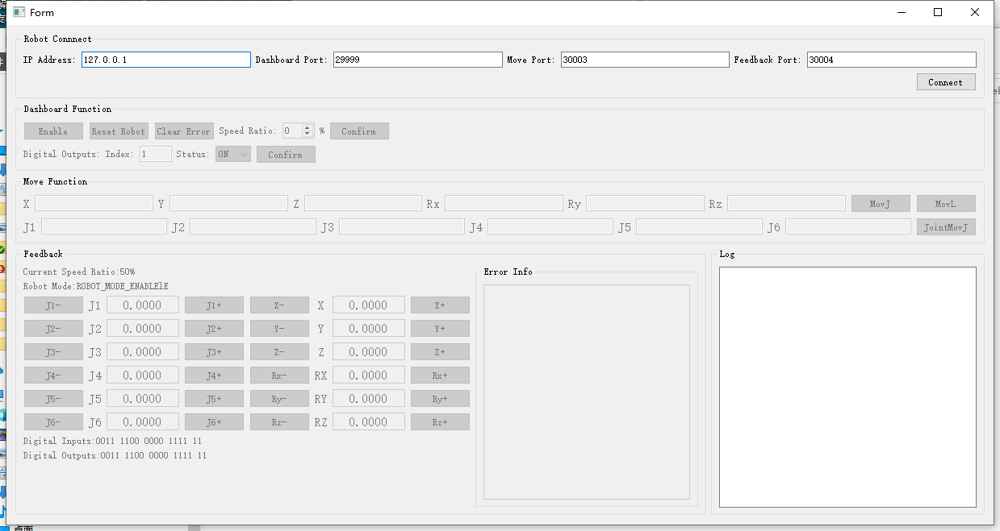

Chinese version of the README -> please [click here](./README.md)

# TCP-IP CR-CPP

About the CR demo, the C++ package based on the TCP/IP protocol, and the UI implemented by Qt.

## File and class descriptions
1. The api directory contains various classes that encapsulate the related functions of CR, which are written based on pure C++.
2. [api/rapidjson](https://github.com/Tencent/rapidjson) is Tencent's open source json parsing library
3. Class descriptions in the api directory:
    - `BitConverter`Encapsulates the conversion of bytes to underlying types。
    - `DescartesPoint`Cartesian Coordinate Structure。
    - `JointPoint`joint point coordinate structure。
    - `FeedbackData`feedback data structure。
    - `ErrorInfoBean`error message。
    - `ErrorInfoHelper`Error message helper class.
    - `DobotClient`The interface class based on tcp communication encapsulates the basic business of communication.
    - `Dashboard`，`DobotMove`，`Feedback`are derived from`DobotClient`,Realize the specific basic functions of the robot, the movement function and the specific business of the feedback.
4. `alarm_controller.json`Warning Alert Profile,`alarm_servo.json`Servo alarm configuration file.
5. `Form.h`,`Form.cpp`,`Form.ui`,`main.cpp`,`CppDemo.pro`It is based on the UI implemented by Qt.

##  Run
1. Open `Qt Creator`，and load the `CppDemo.pro` project.
2. Build and Run.
3. You need to put the `alarm_controller.json` and `alarm_servo.json` files into the directory where the executable file is located.

